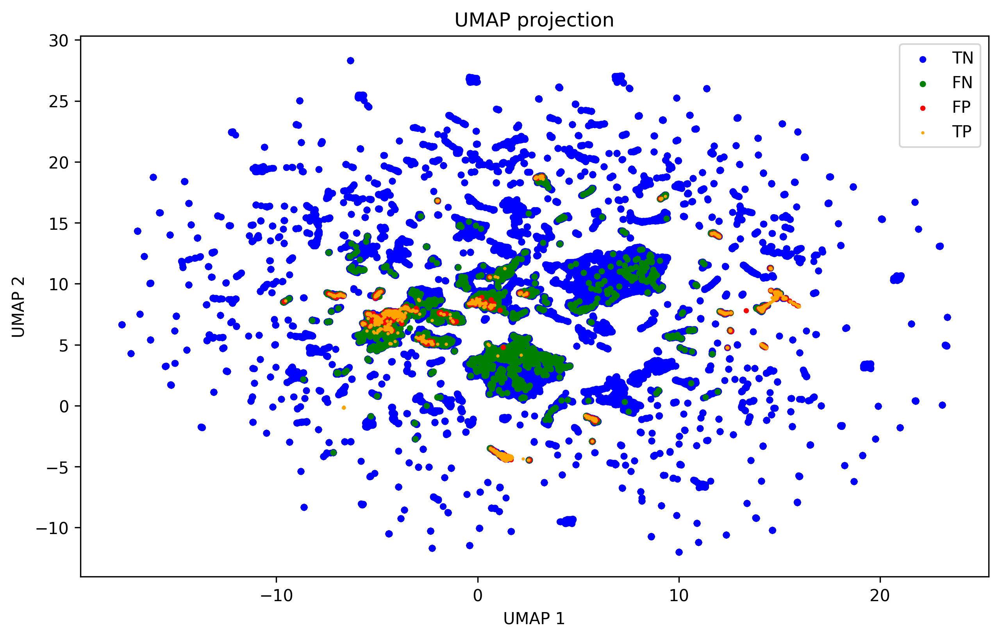

# Project_2_Lab_of_Plotters

### 

### 

###

 **Predicting Income Levels with Machine Learning: A Study on the Census Income Dataset**

## Installation
For Unix (Linux/MacOS):
1. Open your terminal.
2. Run the following command to clone the repository:
   ```bash
   git clone https://github.com/Yifei4905/Project_2_Lab_of_Plotters.git

## Requirements
- **Python 3.8+**
- **Libraries**: Pandas, NumPy, Scikit-learn, Seaborn, Imbalanced-learn, Matplotlib, PIL
- **Installation**: Use `pip install -r requirements.txt` to install dependencies.

## Usage
Start Jupyter Notebook from the project directory.
Open the relevant .ipynb notebook files to explore and run the analysis.

## Project Description
This project focuses on the development and evaluation of machine learning models to predict whether an individual's annual income exceeds $50,000 based on demographic and employment data from the Census Income (KDD) dataset. The primary objective is to implement robust data preprocessing techniques, handle class imbalance, and explore various classification models to improve prediction accuracy.

Through the use of multiple machine learning algorithms, including logistic regression, random forests, and advanced techniques such as SHAP (SHapley Additive exPlanations) and UMAP (Uniform Manifold Approximation and Projection), this project aims to deliver both high-performance models and interpretable insights into feature importance. The project spans various steps, from raw data cleaning to pipeline creation and visualization of high-dimensional data.

Additionally, the project provides utilities for scaling, model creation, and evaluation, all packaged within reusable scripts. The final goal is to not only achieve strong predictive performance but also to foster a deeper understanding of the factors influencing income levels, providing clarity through explainability methods like SHAP.

### **Key Features**:
- **Comprehensive Data Preprocessing**: Extensive handling of both categorical and numerical variables to prepare the dataset for modeling.
- **Model Evaluation**: Comparison of machine learning models, focusing on logistic regression and random forests, while addressing class imbalance with techniques such as oversampling.
- **Advanced Techniques**: Utilization of UMAP for dimensionality reduction and SHAP for model interpretability, ensuring that predictions are both accurate and explainable.
- **Reusable Pipelines**: Implementation of modular and scalable machine learning pipelines for easy experimentation and model training.
- **Explainability**: Analysis of model decisions using SHAP values to provide transparency into the key factors influencing income predictions.


### **Data Model Implementation**

In this project, we implemented several machine learning models to predict income levels based on the Census Income dataset. The primary models included:

1. **Logistic Regression**:
   - A linear model used for binary classification that predicts whether an individual earns more or less than $50,000 per year. 
   - **Max iterations** were set to 500 to ensure convergence.

2. **Random Forest Classifier**:
   - An ensemble method that combines the predictions of multiple decision trees. This model was employed to capture non-linear relationships within the data.
   - **Hyperparameters** such as the number of estimators and tree depth were tuned for optimal performance.

3. **Support Vector Classifier (SVC)**:
   - A model that attempts to maximize the margin between two classes. It was tested on both the scaled and unscaled versions of the dataset to analyze its performance.

4. **Pipeline Implementation**:
   - For each model, a data pipeline was created using `sklearn.pipeline.Pipeline`. This modular approach ensured efficient data preprocessing, scaling, and model training in a single, cohesive process.
   - Data preprocessing included handling missing values, encoding categorical variables, and scaling numerical features using **StandardScaler**.

---

### **Data Model Optimization**

To improve model performance, we applied several optimization strategies:

1. **Hyperparameter Tuning**:
   - We employed **GridSearchCV** to systematically search for the best combination of hyperparameters. Key parameters, such as the regularization strength in logistic regression and the number of trees in random forests, were fine-tuned.

2. **Handling Imbalanced Data**:
   - Given the imbalanced nature of the target variable (more instances of incomes ≤ $50K), we experimented with different resampling techniques:
     - **Random Oversampling**: Added synthetic samples to the minority class to improve model accuracy on higher income predictions.
     - **SMOTE (Synthetic Minority Oversampling Technique)**: Generated synthetic data points for the minority class to reduce model bias.
     - **Random Undersampling**: Reduced the majority class to balance the dataset and test its impact on model accuracy.

3. **Cross-Validation**:
   - **Stratified K-Fold Cross-Validation** was used to ensure that the model performs well across various splits of the dataset, avoiding any chance of overfitting or underfitting.

4. **Model Comparison**:
   - Multiple evaluation metrics, including **ROC AUC**, **F1-score**, and **Precision-Recall Curve**, were used to compare model performance, especially with respect to class imbalance.

---

### **Findings**

✨ **Key Insights Unveiled** ✨

1. **Feature Importance**:
   - After running the models, we observed that **age**, **occupation**, and **education level** were the most influential features in predicting income levels.
   - SHAP values were instrumental in explaining how each feature impacted individual predictions, adding transparency to the model decisions.
    

2. **Model Performance**:
   - **Random Forest Classifier** outperformed other models, providing the highest overall accuracy and robustness to class imbalance, especially when combined with SMOTE.
   - **Logistic Regression** offered more interpretability but struggled with capturing complex relationships in the data.

3. **Imbalanced Data**:
   - Handling the class imbalance was crucial for model success. Oversampling using **SMOTE** significantly improved precision and recall scores, ensuring better performance for predicting individuals earning more than $50,000.
   

4. **Dimensionality Reduction**:
   - Using UMAP, we visualized high-dimensional data, revealing distinct clusters that aligned with income groups. This not only confirmed the importance of certain features but also validated the structure within the dataset.
   

5. **Explainability**:
   - The integration of SHAP values provided invaluable insights into the inner workings of our models. By visualizing the contribution of each feature for specific individuals, we gained a deeper understanding of **why** certain predictions were made, enhancing the trustworthiness of our model.

---

By the end of this project, we successfully developed a series of models capable of accurately predicting income levels based on demographic data. The focus on **model interpretability** and **class imbalance handling** provided a holistic approach, delivering both accurate and explainable outcomes.

## GitHub Repository Setup
- **Folder Structure**: Organized into `data/`, `notebooks/`, and `scripts/` directories.
- **.gitignore**: Included to exclude unnecessary files such as temporary files and large datasets.

## Presentation
The presentation highlights:
- An executive summary of project goals.
- The data collection and cleaning processes.
- The modeling approach and evaluation results.
- Future research directions, including further model tuning and exploring more datasets.

### Dataset Attribution

This repository includes the dataset **Census Income (KDD)**, which was extracted from the **U.S. Census Bureau database** and provided by **Terran Lane and Ronny Kohavi** from the Data Mining and Visualization group at Silicon Graphics.

- Original dataset URL: [Link to the dataset on UCI](https://archive.ics.uci.edu/dataset/117/census+income+kdd)
- License: **Creative Commons Attribution 4.0 International License (CC BY 4.0)**
  - Full license details: [https://creativecommons.org/licenses/by/4.0/](https://creativecommons.org/licenses/by/4.0/)

### License Information

You are free to:
- Share — copy and redistribute the material in any medium or format
- Adapt — remix, transform, and build upon the material for any purpose, even commercially

Under the following terms:
- **Attribution** — You must give appropriate credit, provide a link to the license, and indicate if changes were made. You may do so in any reasonable manner, but not in any way that suggests the licensor endorses you or your use.

