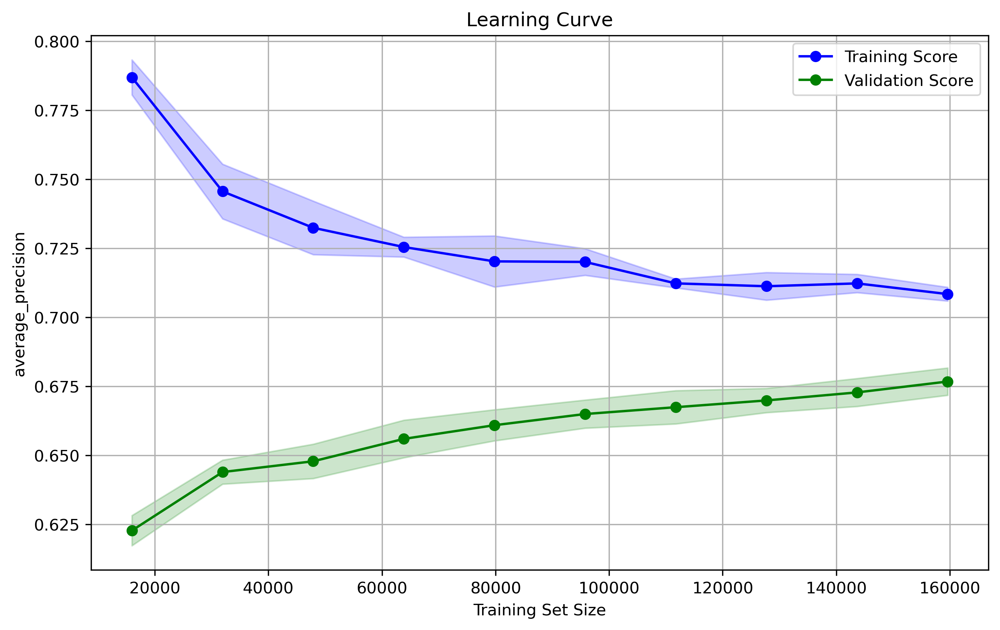
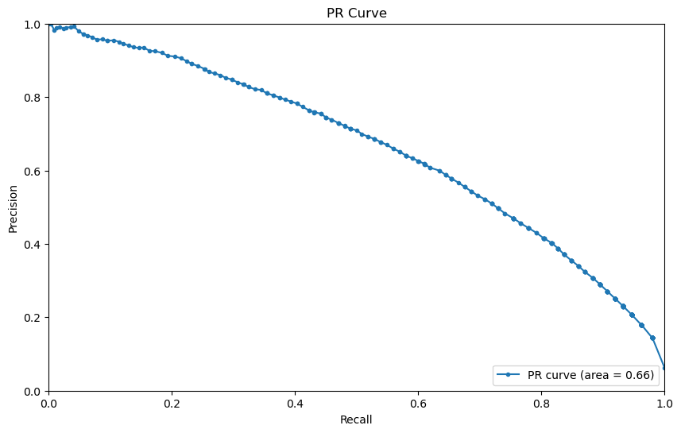
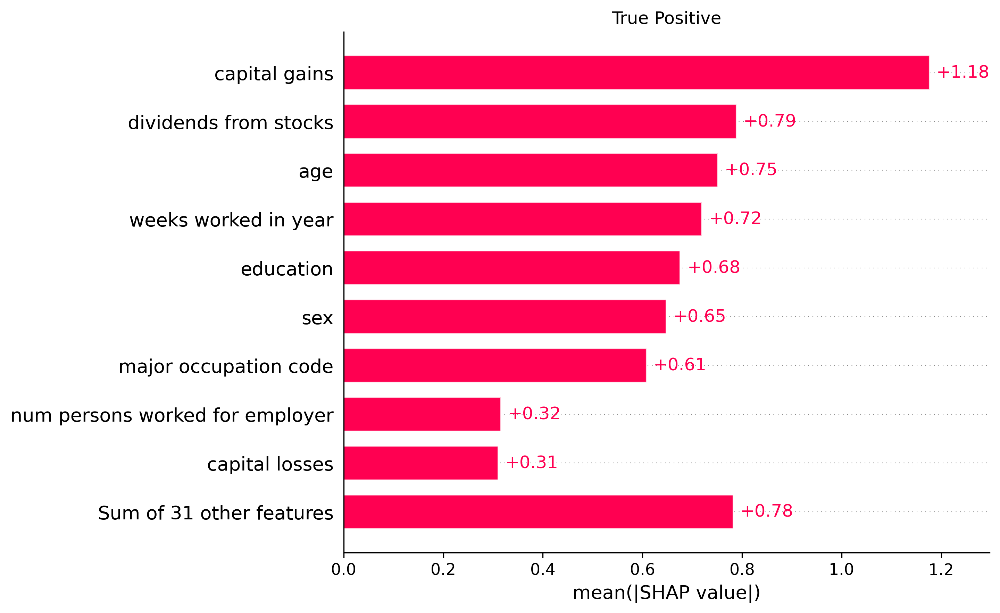

# Findings

1. Many features are irrelevant for prediction.
2. Models perform similarly.
3. Models each have a high ROC value. They have trouble distinguishing True Positive and False Negative (designed to capture True Positive)

# Occupations

These occupations help the model figure out the positive case.

- Lawyers and Judges
- Mathematical and Computer Scientists
- Health Assessment and Treating Occupations
- Health Diagnosing Occupations
- Other Executive, Administrators, and Managers
- Supervisors - Administrative Support
- Technicians, Except Health, Engineering, and Science

# Games/Objectives

Coding was a nightmare.

- Models can be used to simulate the impact of policy changes.
- Dataset was chosen to gain experience with encoding features.
- Learning Curves for insight into minimum error.

# Supporting Figures

